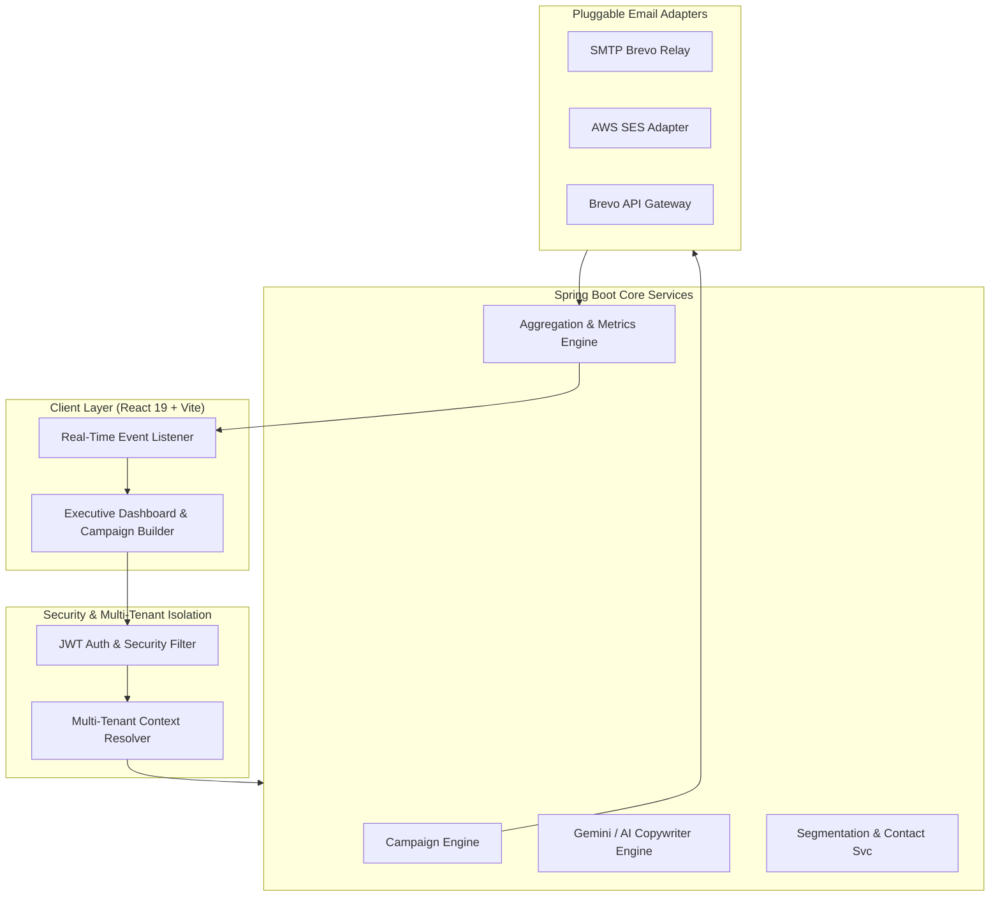

<div align="center">

  # 🚀 MailAlly Enterprise
  ### Next-Generation SaaS Email Marketing & AI Delivery Platform

  [](https://spring.io/projects/spring-boot)
  [](https://react.dev/)
  [](https://vitejs.dev/)
  [](https://tailwindcss.com/)
  [](https://www.mysql.com/)
  [](LICENSE)

  <p align="center">
    <b>Enterprise High-Volume Delivery</b> • <b>Real-Time Analytics</b> • <b>AI Subject & Copy Generation</b> • <b>Multi-Tenant Isolation</b>
  </p>

</div>

---

## 📸 Product Showcases & UI Previews

### 📊 Executive Analytics & Campaign Performance Dashboard
> Unified high-performance dashboard featuring real-time email open trends, delivery rates, active subscriber metrics, and campaign KPIs.


---

### ✍️ AI-Powered Email Campaign Builder & Editor
> Step-by-step campaign creation wizard with real-time responsive mobile/desktop previews, rich text HTML editor, and AI copy generation.


---

### 📈 Real-Time Delivery Stream & Audience Segmentation
> Granular subscriber engagement heatmaps, rule-based audience segment filters, bounce rate funnel analytics, and live activity feeds.


---

## ⚡ Quick Start (1-Click Run)

To start both the **Spring Boot Backend** (Port `8081`) and **React Frontend** (Port `5173`) simultaneously:

### 💻 Windows Batch:
Double-click [start_app.bat](file:///d:/JDBCSW/MailAlly/mailally-backend/start_app.bat) or run in your terminal:
```cmd
start_app.bat
```

### ⚡ Windows PowerShell:
```powershell
.\start_app.ps1
```

---

## 🏗️ System Architecture & Workflow



---

## ✨ Key Features & Capabilities

### 🔐 Enterprise Security & Governance
- **Stateless JWT Security**: Secure, stateless authentication with automated refresh token rotation.
- **Role-Based Access Control (RBAC)**: Fine-grained permissions supporting `SUPER_ADMIN`, `ADMIN`, `MARKETER`, and `VIEWER`.
- **Multi-Tenant Isolation**: Strict data segregation per organization at both database and service layers.

### 📧 High-Volume Email Engine
- **Multi-Provider Architecture**: Dynamic switching between **SMTP Relay**, **Brevo API**, and **AWS SES**.
- **Resilient Retry & Webhook Scheduler**: Built-in automated retries and dead-letter queues for unhandled webhook events.
- **Dynamic Personalization**: HTML/Rich-Text editor with dynamic merge tags (`{{firstName}}`, `{{company}}`, `{{unsubscribeUrl}}`).

### 🤖 AI Copywriter & Subject Line Optimizer
- **Smart Generation**: Generate high-converting subject lines and email copy based on target audience demographics.
- **Spam & Deliverability Scoring**: Real-time pre-flight analysis of email content to maximize inbox placement.

### 👥 Smart Audience Segmentation
- **Rule-Based Dynamic Filters**: Filter contacts by open history, link click frequency, geographic location, and custom tags.
- **Bulk Data Pipeline**: High-speed CSV/XLSX contact importer with built-in deduplication and email syntax validation.

---

## 📁 Repository Structure

```text
mailally-enterprise/
├── docs/                           # Architecture Specifications & Diagnostic Reports
│   ├── DEBUG_REPORT.md             # Email Socket Diagnostic & Socket Fixes
│   ├── PROJECT_ANALYSIS_AND_REVIEW.txt # Comprehensive System Review
│   ├── blueprint.md                # Product Requirements & Architecture Blueprint
│   ├── email_engine_analysis_report.md # Multi-channel Engine Specs
│   └── sample_data/                # Sample CSV / XLSX Contacts Datasets
│
├── images/                         # UI Mockups & Screenshots
│   ├── dashboard_preview.png       # Executive Dashboard Screenshot
│   ├── campaign_builder.png        # Email Builder & AI Assistant
│   └── analytics_preview.png       # Analytics & Segmentation Dashboard
│
├── start_app.bat                   # 1-Click Batch Launcher (Backend + Frontend)
├── start_app.ps1                   # 1-Click PowerShell Launcher
├── clean_project.bat               # Build Artifact Cleanup Script
├── push_to_github.bat              # Automated Git Commit & Push Assistant
│
├── mailally-backend/               # Spring Boot 3.x REST API & Domain Engine
│   ├── scripts/                    # Diagnostic & Test Utility Scripts
│   └── src/main/java/com/mailally/ # Domain Modules (Analytics, Email, Security)
│
└── mailally-frontend/              # React 19 + Vite Frontend SPA
    ├── src/                        # Pages, Components, Hooks & State Management
    ├── package.json
    └── vite.config.js
```

---

## 🌐 Endpoints & API Access

| Service | Access URL | Description |
| :--- | :--- | :--- |
| **Frontend Web App** | [http://localhost:5173](http://localhost:5173) | Single Page Application UI |
| **Backend REST API** | [http://localhost:8081](http://localhost:8081) | Core Spring Boot API Server |
| **Swagger API Docs** | [http://localhost:8081/swagger-ui.html](http://localhost:8081/swagger-ui.html) | Interactive REST API Documentation |

---

<div align="center">
  <sub>Built with ❤️ by MailAlly Engineering Team. Designed for high deliverability and scale.</sub>
</div>
