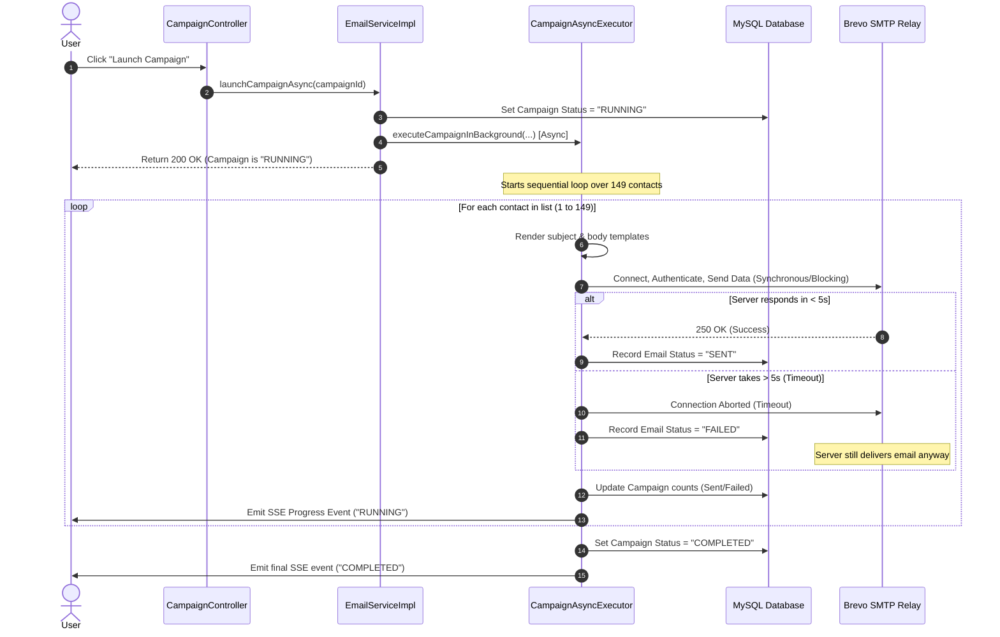

# MailAlly Email Engine: Diagnostic & Architectural Analysis Report

## 1. Executive Summary

During "Test 03" (Subject: *Update Mail on MailAlly Test !!*), a critical mismatch occurred between the user interface metrics and actual delivery results:
- **UI Metrics**: 149 Recipients, 0 Delivered, 149 Failed.
- **Actual Status**: All 149 emails were delivered to the recipients, but sending was extremely slow and the console registered socket timeout errors.

This report diagnoses the root cause of this discrepancy, outlines how the current system processes bulk emails under the hood, verifies the state of third-party message brokers, and offers a clear path toward building an accurate, high-performance delivery system.

---

## 2. Current Email Engine Architecture

The email engine in MailAlly is composed of:
1. **[EmailServiceImpl.java](file:///d:/JDBCSW/MailAlly/mailally-backend/mailally-backend/src/main/java/com/mailally/email/service/impl/EmailServiceImpl.java)**: Coordinates campaign triggering and queries progress.
2. **[CampaignAsyncExecutor.java](file:///d:/JDBCSW/MailAlly/mailally-backend/mailally-backend/src/main/java/com/mailally/email/service/impl/CampaignAsyncExecutor.java)**: Houses the `@Async("emailTaskExecutor")` worker thread which loops through the target lists.
3. **[EmailProviderFactory.java](file:///d:/JDBCSW/MailAlly/mailally-backend/mailally-backend/src/main/java/com/mailally/email/provider/EmailProviderFactory.java)**: Dynamically routes emails to active or fallback providers.
4. **[SmtpEmailProvider.java](file:///d:/JDBCSW/MailAlly/mailally-backend/mailally-backend/src/main/java/com/mailally/email/provider/SmtpEmailProvider.java)**: Sends emails via SMTP using Spring's `JavaMailSender` over Brevo SMTP Relay.

### Asynchronous Thread Pool Configuration
The background dispatching runs on a Spring-managed thread pool (`ThreadPoolTaskExecutor`) named `emailTaskExecutor` defined in **[AsyncConfig.java](file:///d:/JDBCSW/MailAlly/mailally-backend/mailally-backend/src/main/java/com/mailally/config/AsyncConfig.java)**:
- **Core Pool Size**: 5 (can run 5 campaigns concurrently)
- **Max Pool Size**: 20 (burst capacity)
- **Queue Capacity**: 500 (stores campaigns waiting for threads)

---

## 3. Investigation of Redis & Kafka Integration

A deep audit of the project dependencies in **[pom.xml](file:///d:/JDBCSW/MailAlly/mailally-backend/mailally-backend/pom.xml)** confirms the following status:
- **Redis Integration**: ❌ **NOT INTEGRATED**. There are no Redis dependencies (such as `spring-boot-starter-data-redis` or `lettuce`/`jedis`) nor configurations.
- **Kafka Integration**: ❌ **NOT INTEGRATED**. There are no Kafka dependencies (such as `spring-kafka`) or consumer/producer configurations.

### How the Current "Queue" Operates
The application has an `EmailQueue` entity and table. However, it does not function as an active event-driven message queue. Instead, it is a **purely relational JPA database queue**:
- When emails are dispatched, records are inserted sequentially into the `email_queue` table in MySQL.
- There are no background worker daemons or consumers picking up jobs from this table. It functions primarily as a tracking log rather than a pipeline buffer.

---

## 4. Root Cause Analysis: The SMTP Timeout Race Condition

The core bug causing emails to show as `FAILED` in the UI while successfully arriving in the inbox is a **classic network race condition** between the Java client and the Brevo SMTP server.

### Technical Breakdown

1. **Timeout Settings**:
   In `application.properties`, the SMTP write and read timeouts are set to **5 seconds**:
   ```properties
   spring.mail.properties.mail.smtp.connectiontimeout=5000
   spring.mail.properties.mail.smtp.timeout=5000
   spring.mail.properties.mail.smtp.writetimeout=5000
   ```

2. **The SMTP Handshake & Data Transfer**:
   When `SmtpEmailProvider.send(...)` is called:
   - A TCP connection is opened to `smtp-relay.brevo.com:587`.
   - TLS is initialized, authentication details are exchanged, and the message content is transmitted.
   - The Java client then blocks, waiting for the Brevo SMTP relay to respond with `250 OK` (indicating the message has been accepted and queued on the relay).

3. **The Race Condition (Client Timeout vs. Relay Acceptance)**:
   - Due to network latency, TLS negotiations, or Brevo's own internal queues, the SMTP transaction sometimes takes slightly longer than **5 seconds** to return the final `250 OK` status response.
   - Because the 5-second `readtimeout` is exceeded, the Java client throws a `SocketTimeoutException` or `MailSendException`.
   - The catch block in `SmtpEmailProvider` immediately intercepts this exception, registers it as a diagnostic failure, and returns `EmailSendResult.fail()`.
   - Consequently, the campaign executor flags the email as `FAILED` in the database, causing the UI count to display `Failed: 149`.
   - **Crucially**: The Brevo SMTP server had *already received* the complete message data before the timeout occurred. Once the server accepts the data payload, it continues to deliver the email to the recipient's inbox.

4. **Result**:
   The recipient receives the email successfully, but the MailAlly server records it as `FAILED` because it did not wait long enough to receive the `250 OK` confirmation.

---

## 5. Bulk Sending Workflow (Sequential Dispatch Bottleneck)

The second symptom—**extremely slow email sending**—is caused by sequential execution inside the campaign task executor.



Because the `for (Contact contact : contacts)` loop is executed sequentially within a single background thread, sending 149 emails—where each request blocks for up to 5 seconds due to SMTP roundtrips—takes up to **12 minutes** to complete.

---

## 6. Recommendations & Modernization Path

To establish a highly accurate and performant bulk mail engine, we recommend implementing the following improvements:

### Immediate Fixes (No Code Changes)
1. **Increase SMTP Read/Write Timeouts**:
   In `application.properties`, increase the timeout values from `5000` (5 seconds) to `15000` (15 seconds) to prevent false failures:
   ```properties
   spring.mail.properties.mail.smtp.connectiontimeout=15000
   spring.mail.properties.mail.smtp.timeout=15000
   spring.mail.properties.mail.smtp.writetimeout=15000
   ```

### Code Modernization
2. **Parallelize the Asynchronous Loop**:
   Modify the campaign execution loop to dispatch emails concurrently using virtual threads (Java 21) or an executive service thread pool, rather than sending them one-by-one.
   
3. **Switch from SMTP Relay to HTTP API**:
   SMTP has significant handshake overhead (connect, TLS, auth, send, close) for every individual email. Switching to Brevo's REST API endpoint over HTTPS will reduce connection overhead, process bulk uploads faster, and provide immediate transaction IDs.

4. **Integrate Redis for Queue Management**:
   Introduce a real Redis message broker (e.g. using Spring Boot Starter Data Redis and a library like *Spring Batch* or *JobRunr*). This will:
   - De-couple campaign launching from the database.
   - Enable multiple worker instances to process email dispatches in parallel.
   - Prevent database lock contention on MySQL.
